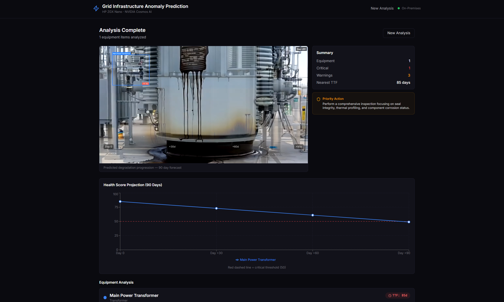

# Grid Infrastructure Anomaly Prediction Demo



**On-premises AI for predicting equipment degradation in electrical substation infrastructure.**

Uses NVIDIA Cosmos AI models on HP ZGX Nano hardware to detect anomalies, classify degradation, and generate AI-predicted degradation visualizations - all without cloud dependencies. Sensitive infrastructure data never leaves the device.

**Target audience:** US Department of Energy / Sandia National Laboratories

---

## Architecture

```
Upload Video → Cosmos-Reason1-7B (detect equipment via vLLM)
                    ↓
             User confirms equipment
                    ↓
             Cosmos-Reason1-7B (classify anomalies, chain-of-thought reasoning)
                    ↓
             Cosmos3-Nano (generate +30/60/90 day degradation videos via diffusers)
                    ↓
             Cross-fade morph + annotation rendering → Annotated output video
```

**Backend:** FastAPI (Python) with async job orchestration
**Frontend:** React + TypeScript + Tailwind CSS (dark mode)
**Detection & Classification:** Cosmos-Reason1-7B (7B VLM, served via vLLM)
**Video Generation:** Cosmos3-Nano (16B unified model, in-process via HuggingFace diffusers)
**Hardware:** HP ZGX Nano — NVIDIA GB10 Grace Blackwell, ARM64, 128GB unified memory

### Model Architecture

| Model | Purpose | Serving Method | GPU Memory |
|-------|---------|---------------|------------|
| Cosmos-Reason1-7B | Equipment detection, anomaly classification | vLLM Docker container (port 8091) | ~41GB |
| Cosmos3-Nano | Degradation video generation (+30/60/90 days) | In-process via diffusers | ~37GB |
| **Combined** | | | **~78GB of 128GB** |

### Why Cosmos3-Nano Instead of Cosmos-Predict2.5?

The original spec called for Cosmos-Predict2.5-2B (Video2World), which conditions future video on your actual input footage. However, Cosmos-Predict2.5 has hard dependencies (`transformer_engine`, `flash-attn`) that [are not available on ARM64/aarch64](https://github.com/nvidia-cosmos/cosmos-predict2.5/issues/120). This is a known issue affecting DGX Spark and ZGX Nano.

Cosmos3-Nano generates degradation videos from text prompts via standard HuggingFace diffusers — no custom NVIDIA packages required. The generated videos are illustrative visualizations of how detected anomalies would progress, not pixel-level predictions of the specific equipment. The detection, classification, health scores, and TTF estimates from Cosmos-Reason1-7B are real analysis of the uploaded footage.

---

## Prerequisites

| Component | Version | Notes |
|-----------|---------|-------|
| Python | 3.12+ | Conda/miniforge recommended |
| Node.js | 20 LTS | For frontend dev server |
| ffmpeg | 5.x+ | H.264/H.265 codec support |
| NVIDIA Driver | 580+ | For GB10 Blackwell |
| CUDA | 13.0 | Bundled with driver |
| Docker | 24+ | Required for vLLM container |
| nvidia-container-toolkit | Latest | Required for GPU in Docker |
| torch | 2.12+ (cu130) | `pip install torch --index-url https://download.pytorch.org/whl/cu130` |
| diffusers | 0.39+ (dev) | `pip install "diffusers @ git+https://github.com/huggingface/diffusers.git"` |

---

## Quick Start

### Option A: Mock Mode (no GPU, instant results)

```bash
git clone <YOUR_REPO_URL> grid-anomaly-prediction
cd grid-anomaly-prediction
chmod +x scripts/*.sh
./scripts/start_all.sh
```

Opens frontend at `http://<YOUR_ZGX_NANO_IP>:5173`. Click "Launch Quick Demo" for pre-rendered AI results.

### Option B: Full Pipeline (GPU required, real AI inference)

```bash
# 1. Download models (~50GB total)
./scripts/download_models.sh

# 2. Start everything
./scripts/start_all.sh --real

# 3. Verify
./scripts/preflight.sh
```

Then upload substation footage through the frontend. Full pipeline takes ~8-10 minutes.

### Startup & Shutdown

```bash
./scripts/start_all.sh              # Mock mode
./scripts/start_all.sh --real       # Real models (GPU)
./scripts/stop_all.sh               # Stop everything
./scripts/preflight.sh              # Health check before demo
```

---

## Environment Variables

| Variable | Default | Description |
|----------|---------|-------------|
| `MOCK_MODELS` | `true` | Use mock inference (no GPU needed) |
| `HOST` | `0.0.0.0` | Server bind address |
| `PORT` | `8094` | Backend API port |
| `LOG_LEVEL` | `INFO` | Logging level |
| `MAX_CONCURRENT_JOBS` | `2` | Max simultaneous processing jobs |
| `VLLM_URL` | `http://localhost:8091/v1` | Cosmos Reason vLLM endpoint |
| `COSMOS_REASON_MODEL` | `nvidia/Cosmos-Reason1-7B` | Detection/classification model |
| `COSMOS3_MODEL` | `nvidia/Cosmos3-Nano` | Video generation model |
| `MIN_DURATION_SEC` | `8` | Minimum upload video duration |

---

## API Endpoints

| Endpoint | Method | Purpose |
|----------|--------|---------|
| `/api/v1/upload` | POST | Upload video for analysis |
| `/api/v1/jobs/{id}/status` | GET | Poll job status and progress |
| `/api/v1/jobs/{id}/equipment` | GET | Get detected equipment list |
| `/api/v1/jobs/{id}/confirm` | POST | Confirm equipment, start analysis |
| `/api/v1/jobs/{id}/results` | GET | Get final analysis results |
| `/api/v1/jobs/{id}/video` | GET | Download annotated morph video |
| `/api/v1/jobs/{id}` | DELETE | Cancel job |
| `/api/v1/health` | GET | Service health check |

---

## Project Structure

```
grid-anomaly-prediction/
├── backend/
│   ├── main.py                    # FastAPI app entry
│   ├── config.py                  # Configuration
│   ├── models/                    # Data models (Job, Equipment, Anomaly)
│   ├── api/v1/                    # Routes and schemas
│   ├── services/
│   │   ├── orchestrator.py        # Async job management
│   │   ├── model_manager.py       # Model lifecycle (Reason + Cosmos3)
│   │   ├── cosmos_reason.py       # Cosmos-Reason1-7B via vLLM HTTP client
│   │   ├── cosmos_predict.py      # Cosmos3-Nano via diffusers
│   │   ├── mock_inference.py      # Mock results for dev/testing
│   │   └── video/                 # Video processing pipeline
│   │       ├── extractor.py       # Frame extraction (ffmpeg)
│   │       ├── morph_generator.py # Cross-fade interpolation
│   │       ├── renderer.py        # Annotation compositing (bboxes, TTF badges)
│   │       ├── encoder.py         # H.264 output encoding
│   │       ├── normalizer.py      # Resolution normalization
│   │       └── pipeline.py        # Full video pipeline orchestration
│   └── store/                     # In-memory job storage
├── frontend/
│   ├── src/
│   │   ├── App.tsx                # Root component, state management
│   │   ├── pages/                 # Upload, EquipmentSelection, Processing, Results
│   │   ├── api/client.ts          # Backend API client
│   │   ├── data/demo-results.ts   # Pre-rendered Quick Demo data
│   │   └── types/index.ts         # TypeScript interfaces
│   └── public/demos/              # Quick Demo video assets
├── scripts/
│   ├── start_all.sh               # Start all services (mock or real)
│   ├── stop_all.sh                # Stop all services
│   ├── preflight.sh               # Pre-demo health check
│   ├── start_cosmos_reason.sh     # Start vLLM with Cosmos-Reason1-7B
│   ├── download_models.sh         # Download models from HuggingFace
│   ├── test_reason.py             # Test Cosmos Reason integration
│   ├── test_predict.py            # Test Cosmos3-Nano integration
│   └── data_prep/                 # Anomaly texture generation, compositing
├── docs/
│   ├── BACKEND_SPEC.md            # Technical specification
│   ├── IMPLEMENTATION_PLAN.md     # Implementation roadmap
│   ├── DEMO_RUNBOOK.md            # Presenter script and troubleshooting
│   └── BACKUP_PLAN.md             # Recovery procedures
├── tasks/
│   ├── todo.md                    # Implementation tracking
│   └── lessons.md                 # Learnings and gotchas
└── tests/
    └── test_api.py                # API integration tests (18 tests)
```

---

## Demo Usage

### Quick Demo (instant, no GPU)

Click "Launch Quick Demo" on the upload page. Loads pre-rendered AI results with a Cosmos3-Nano generated degradation video in under 1 second. Works offline with no backend required.

### Live Demo (real AI inference)

1. Run `./scripts/preflight.sh` — all checks green
2. Upload substation footage (8-25 seconds, 720p+, MP4/MOV/AVI)
3. Cosmos-Reason1-7B detects equipment (~2-3 min, GPU at 96%)
4. Confirm equipment selection
5. Cosmos-Reason1-7B classifies anomalies (~2-3 min)
6. Cosmos3-Nano generates degradation videos (~3-4 min)
7. Video pipeline renders annotated morph (~30 sec)
8. Results page: morph video, health chart, anomaly cards, TTF estimates

See [DEMO_RUNBOOK.md](docs/DEMO_RUNBOOK.md) for the full presenter script.

---

## Hardware Verification

```bash
nvidia-smi                    # GPU: NVIDIA GB10, ~128GB memory
uname -m                      # Should be aarch64
ffmpeg -codecs | grep h264    # H.264 codec available
python3 -c "import torch; print(torch.cuda.is_available(), torch.cuda.get_device_name(0))"
```

---

## Key Design Decisions

- **Compliance by Architecture** — Sensitive infrastructure data never leaves the device. Zero cloud inference dependency.
- **Dual-model pipeline** — Cosmos Reason (vLLM Docker) for reasoning, Cosmos3-Nano (in-process diffusers) for generation. Both fit in 128GB unified memory (~78GB combined).
- **vLLM memory limiting** — `--gpu-memory-utilization 0.35 --enforce-eager` leaves room for Cosmos3-Nano to load alongside.
- **Mock mode by default** — Full API works without GPU for frontend/integration dev.
- **Quick Demo insurance** — Pre-rendered results load instantly if live inference has issues during presentation.
- **Sequential user flow** — Upload → Detect → Confirm → Analyze → Results gives presenter natural narration pause points.

---

## Known Limitations

- **Cosmos3-Nano generates from text, not from input footage.** Degradation videos are illustrative, not pixel-conditioned on the uploaded equipment. Image-conditioned Video2World requires Cosmos-Predict2.5 which [doesn't support ARM64](https://github.com/nvidia-cosmos/cosmos-predict2.5/issues/120).
- **~8-10 minute pipeline** for full live inference. Quick Demo is the recommended path for time-constrained presentations.
- **vLLM chain-of-thought reasoning** consumes significant tokens. Detection calls need 300s timeout and 8192 max_tokens.
- **Desktop only** — Frontend optimized for 1280px+ displays.

---

## Spec Documents

- [Backend Technical Specification](docs/BACKEND_SPEC.md)
- [Implementation Plan](docs/IMPLEMENTATION_PLAN.md)
- [Demo Runbook](docs/DEMO_RUNBOOK.md)
- [Backup Plan](docs/BACKUP_PLAN.md)

---

## License

Apache 2.0


